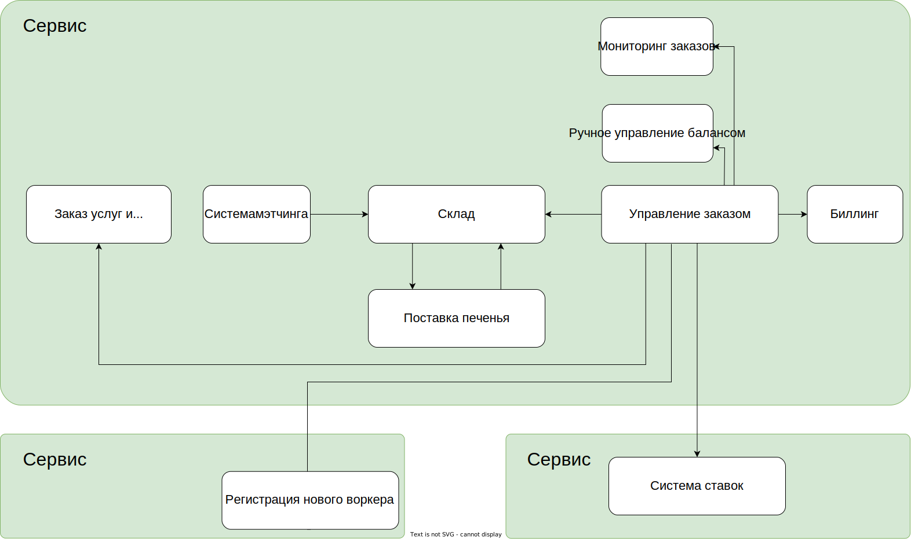

# Event storming модель

# Модель данных

* Информация о workers, clients, orders содержится в домене управления заказами, остальные вляются потребителями этих данных.
* не уверен, что правильно описал источник данных. С одной стороны источник данных по Warker находится в Сервисе регистрации, с другой данныхе хранятся в основном сервисе.
# Общая модель коммуникаций

# Реализация проекта
Веделен основной сервис с общей базой данных. Отдельно вынесен сервис найма воркеров. тк потенциально может подвергнуться высокой нагрузке. Также Можно вынести отдельно сервис ставок как неважный, чтобы изолировать его от основной системы.

# Спорные места
Не указано, кто и как предоставляет список расходников для выдачи. 
Сервис ставок можно не выносить отдельно. Коммуникация между сервисом 
